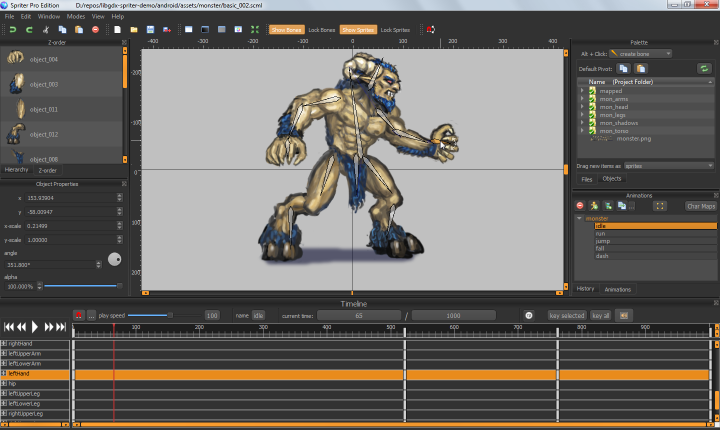
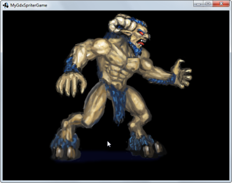

# LibGDX + Spriter Demonstration
Demonstration Project using [LibGDX][] game platform with the [Spriter Runtime][] to produce multi-platform games based on [Spriter][] 2D animations, that run on Android, Desktop, HTML and iOS.

[LibGDX]: https://libgdx.badlogicgames.com
[Spriter]: http://brashmonkey.com
[Spriter Runtime]: https://github.com/Trixt0r/spriter

## Contents
- [Showcase](#Showcase)
- [Credits](#Credits)
- [Requirements](#Requirements)
- [Getting Started](#GettingStarted)
- [Notes](#Notes)

## <a name="Showcase">Showcase</a>

## <a name="Credits">Credits</a>

For most of us, writing good software is about standing on the shoulders of giants.  This demonstration is to showcase the work of others and allow programmers new to the wonders of LibGDX, Spriter, and 2D animation to get a running-start in writing cool 2D games of their own.  

The source code in this demonstration includes work from:

- [LibGDX][] - by [Badlogic Games][].  A fast, intuitive Desktop/Android/BlackBerry/iOS/HTML5 Java game development framework. [more...][libgdx-features]
- [Spriter][spriter] - by [BrashMonkey][]. An easy to use feature rich 2D timeline / skeletal animation product. [more...][spriter-features]
- [Spriter Runtime][] by [Heinrich Reich][trixt0r] and [Discobeard][]. A Generic Java importer for Spriter animation files.[more...][trixt0r-features]

[Badlogic Games]: 	http://www.badlogicgames.com/wordpress/?page_id=2
[libgdx-features]:	https://libgdx.badlogicgames.com/features.html
[BrashMonkey]:     	http://brashmonkey.com/
[Discobeard]:      	https://github.com/Discobeard
[trixt0r]:      	https://github.com/Trixt0r
[spriter-features]: https://brashmonkey.com/spriter-features/
[trixt0r-features]: http://www.youtube.com/watch?v=i_OxqopvMH0

See the README and LICENSE information in the source code/folders for more information.

The knowledge to put this demonstration together comes from the following sources:

- [LibGDX Wiki - Developers Guide][LibGDX-Wiki]
- [Trixt0r Readme - A Generic Java Library for Spriter Animation files][trixt0r-readme]

[LibGDX-Wiki]: https://github.com/libgdx/libgdx/wiki
[trixt0r-readme]: https://github.com/Trixt0r/spriter/blob/master/README.md

## <a name="Requirements">Requirements</a> 
List of the Applications / Frameworks used in this feature demonstration.

- [Eclipse IDE for JAVA Developers][eclipse]
	- The essential tools for any Java developer, including a Java IDE, Git client, Gradle and Maven integration
	- Tested with Eclipse IDE for Java Developers - Juno SR2, Windows 32-bit.
- [LibGDX][libgdx]
	- Desktop/Android/BlackBerry/iOS/HTML5 Java game development framework
	- Gradle setup application, used to create the project gradle environment with LibGDX dependencies.
	- Tested with LibGDX [gdx-setup.jar][libgdx-jar] nightly\dist  (17-Feb-2016)
- [Spriter][spriter]
	- The Spriter IDE - create animations using key-frames constructed from small, re-useable images (such as body parts) and animating the body parts using bones and . This method of animating offers many benefits for several aspects of a game's development and for the finished product. 
- [Spriter Runtime][]
	- A Generic Java runtime for importing and executing [Spriter][] animation files in your game.
	- Tested with commit [74fe6fd][]  (Nov 27, 2015)
- [Android SDK Tools][android-sdk]
	- SDK Tools is a downloadable component for the Android SDK. It includes the complete set of development and debugging tools for the Android SDK.
	- You only need the SDK, not the full Android Studio. Install the latest stable platforms via the SDK Manager.
	- Tested with installer_r24.4.1-windows.exe
- [Android Developer Tools for Eclipse (ADT Plugin)][adt-eclipse]
	- Android Development Tools (ADT) is a plugin for the Eclipse IDE that extends the capabilities of Eclipse to develop Android projects ...
	- Eclipse update site: <https://dl-ssl.google.com/android/eclipse/>
	- Tested with ADT 23.0.7 (August 2015)
- [Gradle Tooling for Eclipse][gradle-eclipse]
	- Gradle Tooling for Eclipse brings you developer tooling for Gradle into Eclipse.
	- Eclipse update site: <http://dist.springsource.com/release/TOOLS/gradle> (for Eclipse < 4.4)
	- Tested with Gradle IDE 3.7.2
- [Java Development Kit (JDK) 7+][oracle-jdk]
	- Tested with Java SE Development Kit 8u73
	- (JDK 6 will not work!)
- Android Device USB / ADB driver 
	- Android USB / ADB Device driver from your device manufacturer.

[eclipse]:     http://www.eclipse.org/downloads/packages/eclipse-ide-java-developers/junosr2
[74fe6fd]: https://github.com/Trixt0r/spriter/tree/74fe6fd8ccd2807f196f25aef4dbbb651f0db5db
[android-sdk]: http://developer.android.com/sdk/index.html#Other
[adt-eclipse]: http://developer.android.com/tools/sdk/eclipse-adt.html
[oracle-jdk]:  http://www.oracle.com/technetwork/java/javase/downloads/index.html
[gradle-eclipse]: https://github.com/spring-projects/eclipse-integration-gradle/

## <a name="GettingStarted">Getting Started</a>

This is a 'clean-sheet' guide for getting you started from having zero applications installed to having a 2D animated game demonstration fully running on your Android device.

### Setup the Developer Environment

1. See [LibGDX Wiki - Setting up your Development Environment][Libgdx-wiki-ide] for full instructions
	1. Install [JAVA SDK 7+][jdk]
	2. Install [Eclipse IDE for Java Developers][eclipse]
	3. Install [Android SDK Tools][android-sdk]
	4. Install [Android Development Tools for Eclipse][adt-eclipse]
	5. Install [Gradle Tooling for Eclipse][gradle-eclipse]
	6. Optional: See [LibGDX Wiki][Libgdx-wiki-ide] for setting up iOS (not tested)
	7. Configure Android SDK (using Android SDK Manager)
		1. Install Android SDK Build Tools 23.0.1
		2. Install Android SDK Platform (API 20)
	8. Install Android Device USB Driver 
		1. If you have a Google phone: Install Google USB Driver using Android SDK Manager
		2. If you have a Samsung phone: Install [Samsung USB Driver][samsung-usb]
		3. If you have a different Android device, install the Android USB / ADB driver from your device manufacturer.

[Libgdx-wiki-ide]: https://github.com/libgdx/libgdx/wiki/Setting-up-your-Development-Environment-%28Eclipse%2C-Intellij-IDEA%2C-NetBeans%29

[samsung-usb]: http://developer.samsung.com/technical-doc/view.do?v=T000000117

### Setup Game Project Workspace
LibGDX provides an executable [gdx-setup.jar][libgdx-jar] for creating an initial Eclipse workspace that includes Android, Desktop, Html, iOS and Core projects, with LibGDX dependencies. This uses [Gradle][] build files to integrate this workspace into Eclipse (or your IDE of choice). 

**For this demonstration, just download / clone the Git project to a folder on your computer.**

1. Use Tortoise GIT to clone <https://github.com/blueacorn/libgdx-spriter-demo> to your computer.

> When you come to create your game project from scratch, you will want to create your own workspace; with your own package and game names:
>
> 1. See [LibGDX - Wiki - Project Setup Gradle][libgdx-setup] for full instructions
> 	1. Run [gdx-setup.jar][libgdx-jar] to create a new game project workspace
>2. Create a new 'spriter' project in the root workspace
>   1. Fetch latest Spriter runtime submodule using git
>      1. Use Tortoise Git to add a submodule: 
>         - Repository: <https://github.com/trixt0r/spriter>
>         - Path:       <*your-new-workspace*\spriter\libs>
>   1. Copy 'spriter' project files from:
>      - From: <https://github.com/blueacorn/libgdx-spriter-demo/spriter/src>
>      - To:   <*your-new-workspace*\spriter>
>   3. Add workspace 'gradle.build' file for 'spriter' project dependencies
>      - See:  <https://github.com/blueacorn/libgdx-spriter-demo/gradle.build>
>      -Update:<*your-new-workspace*\gradle.build>

[libgdx-setup]: https://github.com/libgdx/libgdx/wiki/Project-Setup-Gradle
[libgdx-jar]:   https://libgdx.badlogicgames.com/nightlies/dist/gdx-setup.jar

### Open Workspace in Eclipse
Now that you have your Workspace setup it's time to open it in Eclipse, and build!

1. Import Workspace into Eclipse - See [Eclipse and Grade - Importing][libgdx-wiki-import] for full details
	1. Choose File -> Import 
	2. Select Gradle -> Gradle project, Next
	3. Browse to *your-new-workspace*, Click Build Model
	4. Select all Projects, click Finish
	5. Wait for Gradle for Eclipse plugin to download all other project dependencies 

### Run as Desktop Application

1. In Eclipse, select the 'demo-desktop' project
2. Choose Run > Run 
3. Choose Java Application
4. Choose 'DesktopLauncher' as the main application, click 'OK' to run
5. The Demo Game will now build and run as a Java application on your Desktop
6. Click the 'X' button to close the game

###Run as Android Device Application

1. Ensure you have installed the Android USB / ADB drivers for your device
	1. [How to Install and Use ADB][how-to-adb]
1. Enable your phone for USB Debugging, Unknown Sources
	1. [Android Debug Bridge and Debugging][android-adb]
3. Wait for the drivers to install and the phone to be recognised
4. In Eclipse, select the 'demo-android' project
5. Choose Run > Run
6. Choose Android Application
7. Eclipse should choose the default android application
8. Click Yes to Auto-monitor LogCat (debugging console)
9. Ensure your phone is unlocked
10. The Demo Game will now build and run as an Android application on your Android Device.

[libgdx-wiki-import]: https://github.com/libgdx/libgdx/wiki/Gradle-and-Eclipse#importing-your-project
[how-to-adb]: http://www.howtogeek.com/125769/how-to-install-and-use-abd-the-android-debug-bridge-utility/
[android-adb]: http://developer.android.com/tools/help/adb.html

## <a name="Notes">Notes</a>

*This is a work-in-progress, please Fork, Edit and Push any improvements back to this project, or email me:* 
`github1`[][nul]`@`[][nul]`blueacorn.co.uk`

[nul]: http://nul

---